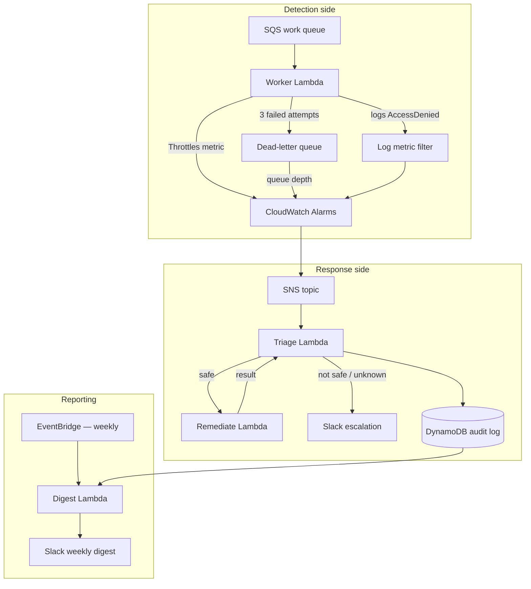
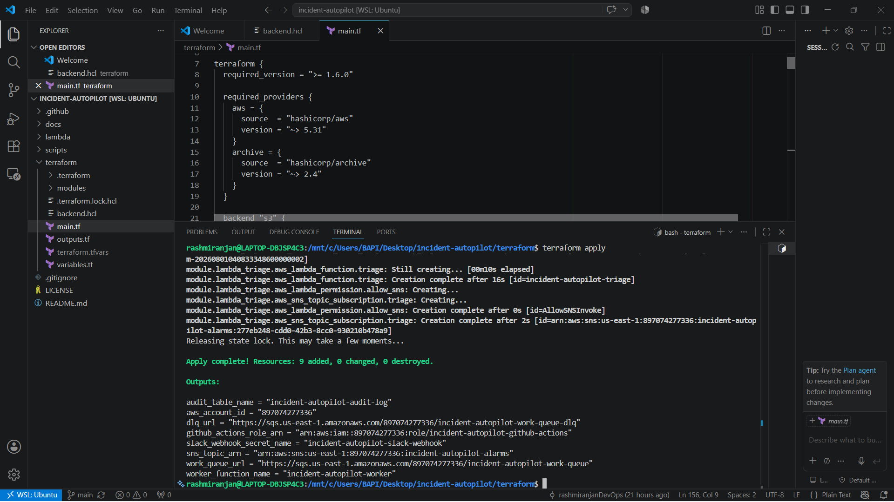
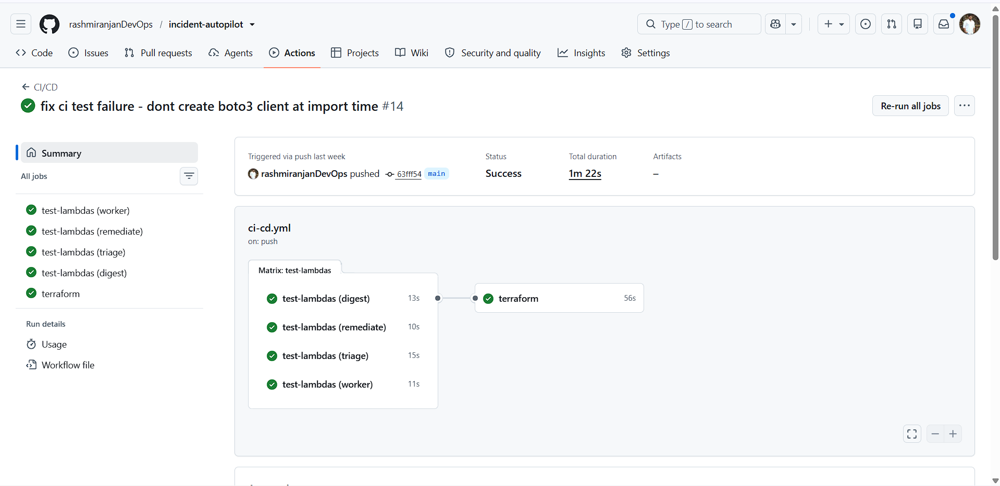
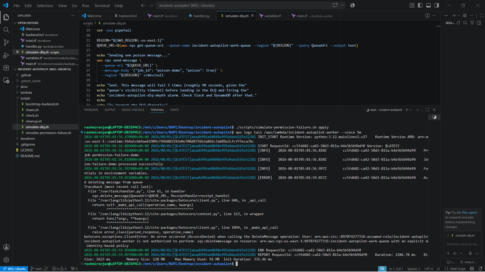
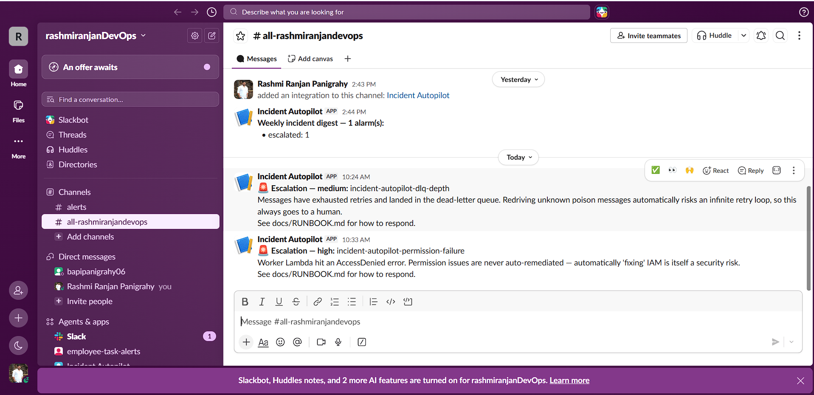
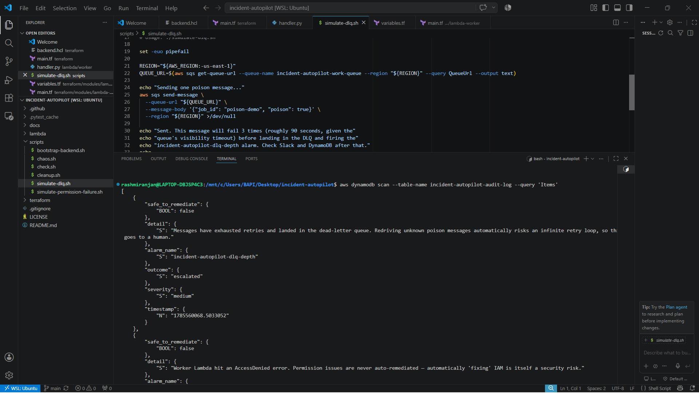

# incident-autopilot

A small AWS pipeline that watches for a few specific kinds of failures,
automatically fixes the ones that are safe to fix, and pings Slack for
everything else — with a full record of what it did and why.

## What is this project?

It's a serverless system built on AWS Lambda, SQS, SNS, DynamoDB, and
CloudWatch. A background job (the "worker") processes messages off a
queue. When something goes wrong with it — it starts throttling, a
message keeps failing, or it hits a permissions error — CloudWatch
notices, and a second Lambda decides what to do about it: fix it
automatically if it's something safe and well-understood, or leave it
for a person if it's not.

## Why did I build it?

This is my second portfolio project, after
[`employee-task-app`](https://github.com/rashmiranjandevops/employee-task-app)
(a Kubernetes/GitOps deployment). That one's all long-running containers
and ArgoCD — I wanted a second project on a completely different part of
AWS: serverless, event-driven, and focused on how you actually respond
when something breaks, not just how you deploy something in the first
place.

## What problem does it solve?

Most portfolio projects show you can deploy something. Way fewer show
what happens when that thing breaks at 2am. This one is my attempt at
answering that specifically: how do you notice a failure, decide if it's
safe to fix without a person involved, actually fix it if so, and leave a
trail either way so nobody has to guess what happened later.

## Architecture



A background job pulls messages off an SQS queue. If it fails enough
times, the message moves to a dead-letter queue. CloudWatch watches for
that, plus throttling, plus permission errors in the logs — any of those
trigger an SNS message. A Triage Lambda picks that up, checks a small
rules file to see if it's something safe to fix automatically, and
either calls a Remediate Lambda (which can only do one very specific,
reversible thing) or posts to Slack for a human to look at. Either way,
it logs what happened to DynamoDB. Once a week, a separate Lambda reads
that log and posts a summary.

Only Triage ever posts to Slack or writes to the audit log — Remediate
just does its one job and reports back to Triage, it doesn't talk to
Slack or DynamoDB directly. More detail on how this fits together (and
why I made a few of the choices I did) is in
[`docs/ARCHITECTURE.md`](docs/ARCHITECTURE.md).

## Tech stack

- **AWS**: Lambda, SQS (+ DLQ), SNS, DynamoDB, CloudWatch (alarms, logs,
  a metric filter), EventBridge, Secrets Manager, IAM
- **IaC**: Terraform, one module per piece of the system
- **CI/CD**: GitHub Actions, authenticating to AWS via OIDC (no
  long-lived AWS keys stored anywhere)
- **Language**: Python 3.12 for all four Lambda functions
- **Testing**: pytest, with `boto3` calls mocked — 25 unit tests, no AWS
  account needed to run them

## Features

- Detects three real failure types: throttling, a message that keeps
  failing (dead-letter queue), and a permissions error
- Automatically fixes the one failure type that's genuinely safe to
  auto-fix (raises the worker's concurrency limit, within a hard cap)
- Escalates everything else to Slack instead of guessing
- Logs every decision — what happened, what was done about it, when — to
  DynamoDB
- Posts a weekly summary to Slack so the whole system stays visible even
  when nothing's on fire
- Every function has its own IAM role with only the permissions it
  actually needs
- Deploys itself through GitHub Actions on every push to `main`, after
  running the full test suite, using OIDC instead of stored AWS keys

## Project structure

```
terraform/
  main.tf                  root config — OIDC role, wires up all the modules below
  modules/
    core/                  the SQS queue+DLQ, DynamoDB table, SNS topic, Secrets Manager secret
    lambda-worker/          the background job + its IAM role
    lambda-triage/           the decision-maker + its IAM role
    lambda-remediate/         the one whitelisted safe action + its IAM role
    lambda-digest/             the weekly summary + its IAM role
    alarms/                    the 3 CloudWatch alarms + the log metric filter

lambda/
  worker/      source + tests
  triage/      source + tests + rules.json
  remediate/    source + tests
  digest/        source + tests

scripts/
  bootstrap-backend.sh              one-time Terraform state setup
  chaos.sh                          triggers the throttling scenario
  simulate-dlq.sh                    triggers the DLQ scenario
  simulate-permission-failure.sh      triggers the permission-error scenario
  cleanup.sh                          tears everything down safely
  check.sh                             confirms everything is actually deployed

docs/
  ARCHITECTURE.md    how it fits together, and why
  DEPLOYMENT.md        setup, cost, teardown, troubleshooting
  SECURITY.md            IAM design and secrets handling
  TESTING.md               what's covered and how to run it
  RUNBOOK.md                 what to do for each type of alert
  DIAGRAMS.md                 the architecture diagram above, on its own
```

## How to deploy

Short version:
```bash
./scripts/bootstrap-backend.sh us-east-1
# update terraform/backend.hcl with the bucket name it prints
cd terraform && terraform init -backend-config=backend.hcl && terraform apply
# then set the Slack webhook secret, and add the deploy role ARN as a GitHub secret
```
Full step-by-step (including the Slack webhook and CI setup) is in
[`docs/DEPLOYMENT.md`](docs/DEPLOYMENT.md).

## What I ran into while deploying this

To be upfront — I didn't design this system from scratch, I deployed it,
debugged it, and tested it against real AWS infrastructure. That process
wasn't smooth, and I think the problems I hit (and how I fixed them) are
worth more than pretending it just worked first try:

- My AWS account's default Lambda concurrency limit (10, not the usual
  1000) blocked the first deploy — had to request a quota increase and
  work around it in the meantime
- GitHub Actions couldn't authenticate to AWS at first. Turned out
  GitHub's OIDC token format changed to include numeric owner/repo IDs,
  and the trust policy wasn't written to match — had to debug the actual
  token contents to catch it
- The GitHub Actions IAM role was missing several read-only permissions
  it needed just to run `terraform plan` — found and added them one at a
  time, following the actual `AccessDenied` errors
- While testing the permission-failure scenario, I found the worker was
  relying on AWS's automatic message-deletion behavior, which fails
  silently if permissions are wrong — nothing showed up in the logs, so
  the alarm never fired. Fixed it by making the worker delete messages
  itself and log the failure properly

## Screenshots

**Infrastructure deployed from scratch:**


**Tests + deploy, fully automated:**


**A real incident, detected:**


**...and the worker's actual error, logged properly (this is the bug fix
described above, proven working):**


**The team gets notified, with the right severity:**


**Every decision recorded:**


## Demo

There are three scripted scenarios you can trigger on demand — each one
is documented in detail in [`docs/RUNBOOK.md`](docs/RUNBOOK.md),
including exactly what to expect:

```bash
./scripts/chaos.sh                                # throttling -> auto-remediated
./scripts/simulate-dlq.sh                          # a message that always fails -> escalated
./scripts/simulate-permission-failure.sh apply     # a permissions error -> escalated
./scripts/simulate-permission-failure.sh revert    # always run this after the one above
```

## Future improvements

Things I thought about and deliberately left out for now, rather than
things I forgot:

- **AI-assisted alert summaries** — I actually considered using an LLM to
  help write the triage decision itself, and decided against it: a small
  rules file is easier to trust, audit, and explain than a model call,
  and it keeps this a DevOps project instead of an AI project. Might
  revisit *just* for writing a nicer-sounding Slack summary later, as a
  clearly separate, non-decision-making step.
- A second safe remediation action (right now there's only one)
- Tiered escalation (right now everything goes to one Slack channel — a
  real on-call setup would route by severity)
- Multi-region — not something a demo project like this needs, but worth
  knowing how I'd approach it
- Get the throttling scenario fully demoed end to end once my AWS
  account's concurrency quota increase is approved