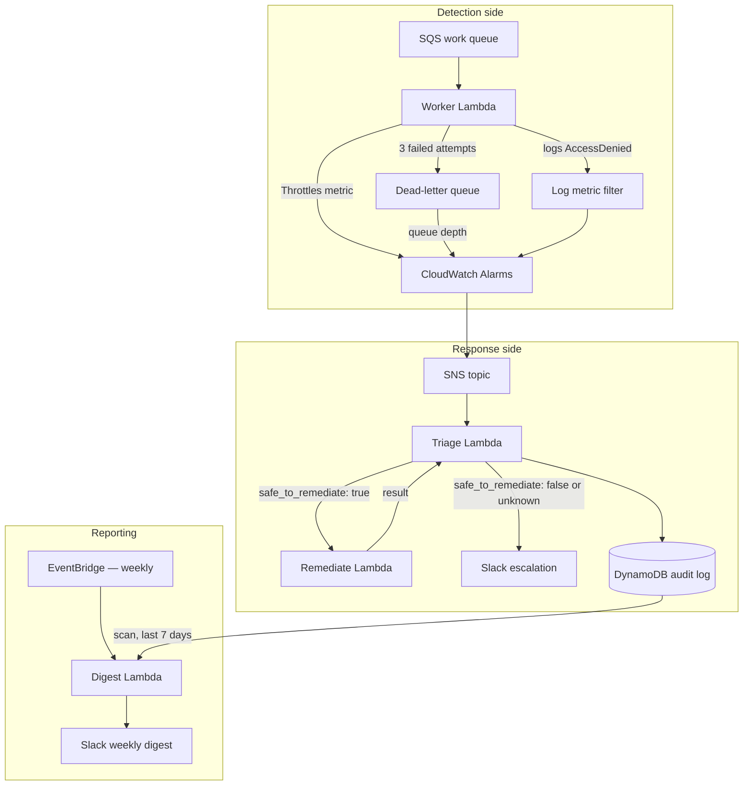

# Architecture diagram

Renders natively on GitHub — no image file needed.

```mermaid
flowchart TD
    subgraph Detection["Detection side"]
        Q[SQS work queue] --> W[Worker Lambda]
        W -->|3 failed attempts| DLQ[Dead-letter queue]
        W -->|Throttles metric| CW[CloudWatch Alarms]
        DLQ -->|queue depth| CW
        W -->|logs AccessDenied| MF[Log metric filter] --> CW
    end

    CW --> SNS[SNS topic]

    subgraph Response["Response side"]
        SNS --> T[Triage Lambda]
        T -->|safe_to_remediate: true| R[Remediate Lambda]
        T -->|safe_to_remediate: false or unknown| SLACK1[Slack escalation]
        R -->|result| T
        T --> DDB[(DynamoDB audit log)]
    end

    subgraph Reporting["Reporting"]
        EB[EventBridge — weekly] --> D[Digest Lambda]
        DDB -->|scan, last 7 days| D
        D --> SLACK2[Slack weekly digest]
    end
```
